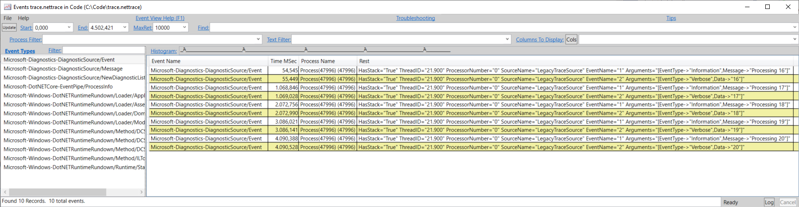
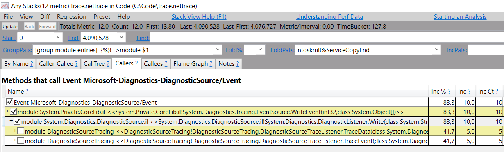

# Using DiagnosticSource through TraceSource

This spike showcases how to convert/upgrade `TraceSource` traces to the newer `DiagnosticSource` 
and thus get automatic ETW/Perfview support.

The `DiagnosticSourceTraceListener` performs a naive conversion from `TraceData/TraceEvent` into 
`DiagnosticSource` events, and exposes the passed in arguments (data, message, format and args) 
as event data that can be automatically forwarded to ETW.

See [Program.cs](DiagnosticSourceTracing/Program.cs) to see the usual tracing code using `TraceSource`.


## Prerequisites

In order to collect the logs and open them in perfview, you will need the `dotnet-trace` tool:

```
> dotnet tool install --global dotnet-trace
```

To view the traces, you will need `PerfView`. [Download the latest](https://github.com/microsoft/perfview/releases/latest).

## Running

1. Open the `DiagnosticSourceTracing.sln` solution and run it. 
2. From another command prompt, run `dotnet trace ps` to list the processes you can collect 
   traces from. Note the process ID of the running `DiagnosticSourceTracing.exe` console app
3. Start trace collection: `dotnet trace collect -p [ID] --providers Microsoft-Diagnostics-DiagnosticSource`
4. Stop the trace collection at any point. A new `trace.nettrace` file would be created in the 
   current directory. Open that file with `PerfView.exe`

The resulting Events view would be something like:



And the Any Stacks view:

